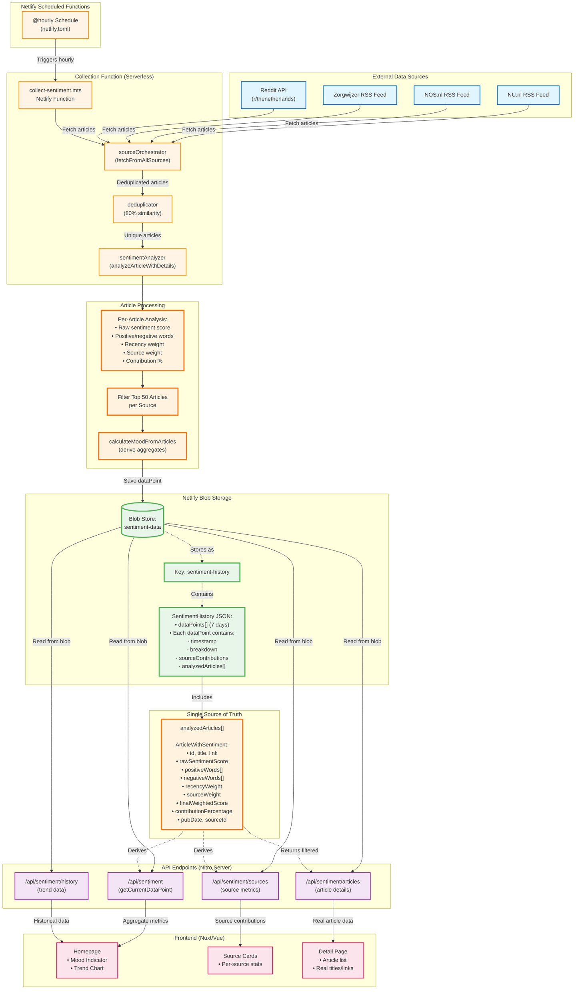

# Data Flow Architecture - Netlify Functions & Blob Storage

This diagram shows how data flows through the Zorg Sentiment application, including collection, storage, and retrieval.



## Key Points

### Blob Storage Structure

**Only ONE blob key exists**: `sentiment-history`

This contains:

```json
{
  "version": "1.0.0",
  "lastUpdated": "2025-11-16T10:00:00Z",
  "retentionDays": 7,
  "dataPoints": [
    {
      "timestamp": "2025-11-16T10:00:00Z",
      "breakdown": { "positive": 25, "neutral": 50, "negative": 25 },
      "sourceContributions": [...],
      "analyzedArticles": [
        {
          "id": "nu-nl-gezondheid-abc123",
          "title": "Real article title from NU.nl",
          "link": "https://www.nu.nl/...",
          "rawSentimentScore": 0.65,
          "positiveWords": ["verbetering", "vooruitgang"],
          "negativeWords": [],
          "recencyWeight": 0.95,
          "contributionPercentage": 8.2,
          "pubDate": "2025-11-16T09:30:00Z"
        }
        // ... up to ~400 articles total (top 50 per source)
      ]
    }
    // ... up to 168 dataPoints (7 days × 24 hours)
  ]
}
```

### Data Flow Summary

1. **Collection** (hourly via Netlify scheduled function)

   - Fetches from RSS/Reddit sources
   - Deduplicates across sources
   - Analyzes each article individually
   - Stores top 50 articles per source

2. **Storage** (Netlify Blob Storage)

   - Single blob: `sentiment-history`
   - Contains 7 days of hourly data points
   - Each data point includes ~400 analyzed articles
   - Total size: ~50MB (within Netlify limits)

3. **Retrieval** (API endpoints)

   - All endpoints read from same blob
   - All metrics derived from `analyzedArticles[]`
   - Single source of truth across entire app

4. **Frontend** (Nuxt/Vue)
   - Homepage, source cards, detail pages
   - All display data from same articles
   - No mock/dummy data anywhere

### Storage Limits

- **Netlify Blob limit**: 50MB per site
- **Retention**: 7 days (168 data points max)
- **Articles per collection**: ~400 total (top 50 per source)
- **Article size**: ~2KB each (title, excerpt, scores, words)
- **Total estimated**: ~50MB (168 points × 400 articles × 2KB)
