# Multi-Source Sentiment Collection Architecture

**Document Version**: 1.0  
**Last Updated**: October 27, 2025  
**Feature**: 002-multi-source-sentiment  
**Status**: Implemented

## Overview

The multi-source sentiment collection system aggregates data from multiple independent sources (RSS feeds, social media, APIs) to provide comprehensive sentiment analysis. The architecture uses an **adapter pattern** with a central **orchestrator** to enable graceful degradation when sources fail and easy extensibility for new source types.

## Architecture Diagram

```mermaid
%%{init: {'theme':'base'}}%%
flowchart TD
    Scheduler["⏰ Netlify Scheduled Function<br/>(collect-sentiment.mts - Hourly)"]

    Scheduler --> Orchestrator

    subgraph Orchestrator["🎯 Source Orchestrator (sourceOrchestrator.ts)"]
        direction TB
        Config["📋 sources.json<br/>configurations"]
        Registry["Adapter Registry (Map)"]

        Config --> Registry

        Registry --> |"SourceType.RSS"| RSSMap["→ RSSAdapter"]
        Registry --> |"SourceType.SOCIAL_TWITTER"| TwitterMap["→ TwitterAdapter (stub)"]
        Registry --> |"SourceType.SOCIAL_REDDIT"| RedditMap["→ RedditAdapter"]

        Note1["✓ Parallel fetch (Promise.allSettled)<br/>✓ 10s timeout per source<br/>✓ Graceful degradation<br/>✓ Per-source metrics"]
    end

    Orchestrator --> RSSAdapter["📰 RSS Adapter<br/>(Active)"]
    Orchestrator --> TwitterAdapter["🐦 Twitter Adapter<br/>(Stub)"]
    Orchestrator --> RedditAdapter["🤖 Reddit Adapter<br/>(Active)"]

    RSSAdapter --> RSSFeeds["5 RSS Feeds<br/>(NU.nl, NOS, etc.)"]
    TwitterAdapter --> TwitterAPI["Twitter API<br/>(Planned)"]
    RedditAdapter --> RedditAPI["Reddit API<br/>(snoowrap)"]

    RSSFeeds --> Dedup["🔍 Deduplicator<br/>(80% similarity)"]
    TwitterAPI --> Dedup
    RedditAPI --> Dedup

    Dedup --> Analyzer["📊 Sentiment Analyzer<br/>(sentiment.js)"]
    Analyzer --> Storage["💾 Netlify Blobs<br/>(7-day retention)"]
```



## Core Components

### 1. Source Orchestrator (`server/utils/sourceOrchestrator.ts`)

**Responsibilities**:

- Load source configurations from `sources.json`
- Filter active sources only
- Dispatch fetch requests to appropriate adapters
- Collect results with `Promise.allSettled` (graceful degradation)
- Deduplicate articles across sources
- Calculate source contribution metrics
- Calculate source diversity statistics

**Key Functions**:

```typescript
export async function fetchFromAllSources(
  sources: SourceConfiguration[]
): Promise<OrchestrationResult>;
```

**Returns**:

- `articles: Article[]` - Unique articles after deduplication
- `sourceContributions: SourceContribution[]` - Per-source metrics
- `sourceDiversity: SourceDiversity` - Overall diversity stats
- `totalDurationMs: number` - Total execution time

**Error Handling**:

- Individual source failures don't stop collection
- Failed sources logged with error details
- Contribution entries created for failed sources (status: 'failed')
- System continues with remaining successful sources

### 2. Source Adapter Interface (`server/utils/sourceAdapter.ts`)

**Purpose**: Common interface for all data source types, enabling polymorphic source handling.

**Interface Definition**:

```typescript
export interface SourceAdapter {
  /**
   * Fetch articles from the source
   * @throws Error if fetch fails (caught by orchestrator)
   */
  fetchArticles(config: SourceConfiguration): Promise<Article[]>;

  /**
   * Validate source configuration
   * @returns true if config is valid, false otherwise
   */
  validateConfig(config: SourceConfiguration): boolean;

  /**
   * Get unique identifier for this source
   */
  getIdentifier(config: SourceConfiguration): string;

  /**
   * Check if adapter supports a specific source type
   */
  supportsSourceType(type: SourceType): boolean;
}
```

**Design Benefits**:

- Single interface for all source types
- Easy to add new source types
- Testable in isolation
- Clear contract for implementation

### 3. Adapter Implementations

#### RSS Adapter (`server/utils/rssAdapter.ts`)

**Status**: ✅ Fully Implemented

**Responsibilities**:

- Parse RSS/Atom feeds using xml2js
- Normalize RSS items to Article format
- Generate deduplication hash (SHA-256 of title + content)
- Enforce article limits (max 30 per source)
- Handle timeouts and network errors

**Configuration Requirements**:

```json
{
  "type": "RSS",
  "url": "https://example.com/feed.xml"
}
```

#### Twitter Adapter (`server/utils/twitterAdapter.ts`)

**Status**: 🚧 Stub Implementation

**Current Behavior**: Throws "Not implemented yet" error

**Planned Responsibilities**:

- Authenticate with Twitter API v2
- Search tweets by keywords/hashtags
- Normalize tweets to Article format
- Handle rate limiting
- Support both organic and reply tweets

**Future Configuration**:

```json
{
  "type": "SOCIAL_TWITTER",
  "url": "https://api.twitter.com/2/tweets/search/recent",
  "credentials": {
    "bearerToken": "..."
  },
  "searchQuery": "#zorgverzekering OR #zorg"
}
```

#### Reddit Adapter (`server/utils/redditAdapter.ts`)

**Status**: 🚧 Stub Implementation

**Current Behavior**: Throws "Not implemented yet" error

**Planned Responsibilities**:

- Fetch posts from subreddits via Reddit API
- Normalize posts/comments to Article format
- Handle Reddit authentication
- Filter by score/engagement

**Future Configuration**:

```json
{
  "type": "SOCIAL_REDDIT",
  "url": "https://www.reddit.com/r/health/.json",
  "subreddit": "health",
  "minScore": 10
}
```

### 4. Deduplicator (`server/utils/deduplicator.ts`)

**Purpose**: Detect and eliminate duplicate articles across different sources.

**Algorithm**:

1. **Hash Matching (O(1))**: Compare SHA-256 hashes of title + content
2. **Title Similarity (O(n))**: Levenshtein distance on titles
   - Early exit if similarity < 50%
3. **Content Similarity (O(n))**: Levenshtein distance on full content
   - Only run if title similarity 50-80%
4. **Threshold**: 80% similarity = duplicate

**Performance**: ~10-15s for 80 articles (9x improvement over naive approach)

**Key Function**:

```typescript
export function isDuplicate(
  article: Article,
  existingArticles: Article[]
): boolean;
```

### 5. Source Configuration (`server/config/sources.json`)

**Purpose**: Centralized configuration for all data sources.

**Schema**:

```typescript
interface SourceConfiguration {
  id: string; // Unique identifier
  name: string; // Human-readable name
  type: SourceType; // RSS, SOCIAL_TWITTER, SOCIAL_REDDIT, API
  url: string; // Source endpoint
  category: string; // "general" | "healthcare-specific"
  isActive: boolean; // Enable/disable source
  maxArticles: number; // Limit per collection (default: 30)
  timeout: number; // Fetch timeout in ms (default: 10000)
  priority?: number; // Optional: 1 (high) to 5 (low)
  credentials?: object; // Optional: API keys, tokens
}
```

**Current Sources** (as of October 2025):

- NU.nl Gezondheid (RSS, general)
- NOS.nl Algemeen (RSS, general)
- Zorgwijzer (RSS, healthcare-specific)
- RTL Nieuws Algemeen (RSS, general)
- Zorgkrant (RSS, healthcare-specific)

### 6. Article Normalization (`server/types/article.ts`)

**Purpose**: Unified article format across all source types.

**Schema**:

```typescript
export interface Article {
  title: string; // 10-500 chars
  description: string; // 20-2000 chars
  content: string; // Combined for sentiment analysis
  link: string; // Canonical URL
  pubDate: string; // ISO 8601 timestamp
  sourceId: string; // References SourceConfiguration.id
  deduplicationHash: string; // SHA-256 of title + content

  // Optional: Social media specific
  authorHandle?: string; // Twitter: @handle, Reddit: u/username
  postUrl?: string; // Direct link to post
  engagementMetrics?: {
    likes?: number;
    shares?: number;
    comments?: number;
  };
}
```

**Normalization Rules**:

- Title: Remove HTML tags, trim whitespace, max 500 chars
- Description: Extract summary, remove tags, max 2000 chars
- Content: Combine title + description for sentiment analysis
- Link: Use canonical URL, fallback to feed item link
- PubDate: Convert to ISO 8601, default to current time if missing
- DeduplicationHash: SHA-256 of `${title.toLowerCase()}|${content.toLowerCase()}`

## Data Flow

### Collection Cycle (Hourly)

```
1. Netlify Scheduler triggers collect-sentiment.mts
2. Load sources from sources.json
3. Filter active sources (isActive: true)
4. Orchestrator dispatches to adapters in parallel:
   - RSS: Fetch 5 feeds simultaneously
   - Twitter: (stub, would fetch tweets)
   - Reddit: (stub, would fetch posts)
5. Each adapter:
   - Fetches data from source
   - Normalizes to Article format
   - Generates deduplication hash
   - Returns Article[] or throws error
6. Orchestrator collects results:
   - Promise.allSettled waits for all (max 10s each)
   - Successful: Articles added to pool
   - Failed: Error logged, contribution marked 'failed'
7. Deduplication:
   - Compare all articles using 80% similarity threshold
   - Keep first occurrence of duplicates
8. Sentiment Analysis:
   - Analyze each unique article
   - Calculate positive/neutral/negative scores
9. Build SourceContribution entries:
   - Per-source article counts
   - Per-source sentiment breakdown
   - Fetch timing and status
10. Calculate SourceDiversity:
    - Total sources configured
    - Active sources (successfully fetched)
    - Failed sources
11. Store to Netlify Blobs:
    - SentimentDataPoint with articles
    - SourceContribution[] with metrics
    - SourceDiversity with stats
    - 7-day TTL for automatic cleanup
12. Return success/failure status
```

### API Request Flow

```
1. Client requests GET /api/sentiment/sources
2. Server reads latest sentiment blob
3. Extract sourceContributions array
4. Calculate 7-day aggregated metrics:
   - Success rate per source
   - Average articles per source
   - Reliability score
5. Return SourceMetrics[] to client
6. Cache for 5 minutes (avoid repeated blob reads)
```

## Design Patterns

### 1. Adapter Pattern

**Purpose**: Isolate source-specific logic from core sentiment collection.

**Benefits**:

- New sources added without modifying orchestrator
- Each adapter independently testable
- Clear separation of concerns
- Easy to mock in tests

**Implementation**:

- `SourceAdapter` interface defines contract
- Concrete adapters (RSS, Twitter, Reddit) implement interface
- Orchestrator depends only on interface, not implementations
- Adapter registry maps SourceType → Adapter instance

### 2. Registry Pattern

**Purpose**: Dynamic adapter lookup at runtime.

**Implementation**:

```typescript
const adapterRegistry = new Map<SourceType, SourceAdapter>([
  [SourceType.RSS, new RSSAdapter()],
  [SourceType.SOCIAL_TWITTER, new TwitterAdapter()],
  [SourceType.SOCIAL_REDDIT, new RedditAdapter()],
]);
```

**Benefits**:

- O(1) adapter lookup
- Easy to add/remove adapters
- Clear visibility of supported types
- Type-safe with TypeScript enums

### 3. Graceful Degradation Pattern

**Purpose**: System remains functional even when individual sources fail.

**Implementation**:

- Use `Promise.allSettled` instead of `Promise.all`
- Continue with successful sources
- Log failures without throwing
- Return partial results

**Benefits**:

- High availability
- Resilient to individual source outages
- User sees data even if some sources down
- Clear visibility of which sources failed

### 4. Template Method Pattern (in adapters)

**Purpose**: Common fetching workflow, source-specific details.

**Workflow** (each adapter):

1. Validate configuration
2. Connect to source
3. Fetch raw data (with timeout)
4. Normalize to Article format
5. Generate deduplication hash
6. Return Article[]

### 5. Strategy Pattern (deduplication)

**Purpose**: Pluggable deduplication algorithms.

**Current Strategy**: Three-stage similarity check

- Stage 1: Hash comparison (exact matches)
- Stage 2: Title-only Levenshtein (<50% early exit)
- Stage 3: Full content Levenshtein (50-80% threshold)

**Future Strategies**:

- Semantic similarity (embeddings)
- ML-based duplicate detection
- Source authority weighting

## Performance Considerations

### Parallel Fetching

**Design**: All sources fetched simultaneously using `Promise.allSettled`

**Benefits**:

- Total time = max(source_times), not sum(source_times)
- 5 sources @ 3s each = 3s total (not 15s)

**Constraints**:

- 10-second timeout per source enforced
- 30 articles max per source (prevents memory issues)

### Deduplication Optimization

**Problem**: Naive Levenshtein on all pairs = O(n²) with expensive string comparison

**Solution**: Three-stage algorithm

1. **Hash lookup**: O(1) for exact matches
2. **Title screening**: O(n) with early exit
3. **Content comparison**: Only when needed

**Results**:

- 80 articles: ~10-15s (acceptable)
- 200+ articles: Would need further optimization (batch processing, sampling)

### Caching Strategy

**Source Metrics API**: 5-minute cache

- Reduces Netlify Blob reads
- Acceptable staleness for metrics
- Invalidated on new collection cycle

**Sentiment Data**: No cache (real-time)

- Dashboard needs latest mood
- Blob reads are fast (<100ms)

## Error Handling

### Source-Level Errors

**Scenarios**:

- Network timeout (>10s)
- Invalid RSS feed (malformed XML)
- HTTP errors (404, 500, 503)
- Authentication failures (APIs)

**Handling**:

- Adapter throws error
- Orchestrator catches with Promise.allSettled
- Creates SourceContribution with status: 'failed'
- Logs error with source name and details
- Continues with other sources

### System-Level Errors

**Scenarios**:

- All sources fail
- Sentiment analysis fails
- Storage write fails

**Handling**:

- Netlify Function returns 500 status
- Error logged to Netlify function logs
- No data written to blobs
- Previous data remains available (stale)

### Client-Side Errors

**Scenarios**:

- API request fails
- Data parsing errors
- Component rendering errors

**Handling**:

- Display "Data temporarily unavailable"
- Show last known data with timestamp
- Automatic retry after 60 seconds

## Extensibility

### Adding a New Source Type

See [Extending Sources Guide](../extending-sources.md) for complete walkthrough.

**Quick Steps**:

1. **Add SourceType enum value**:

   ```typescript
   // server/types/source.ts
   export enum SourceType {
     RSS = "RSS",
     SOCIAL_TWITTER = "SOCIAL_TWITTER",
     SOCIAL_REDDIT = "SOCIAL_REDDIT",
     NEW_TYPE = "NEW_TYPE", // Add here
   }
   ```

2. **Implement adapter**:

   ```typescript
   // server/utils/newTypeAdapter.ts
   export class NewTypeAdapter implements SourceAdapter {
     async fetchArticles(config: SourceConfiguration): Promise<Article[]> { ... }
     validateConfig(config: SourceConfiguration): boolean { ... }
     getIdentifier(config: SourceConfiguration): string { ... }
     supportsSourceType(type: SourceType): boolean { ... }
   }
   ```

3. **Register adapter**:

   ```typescript
   // server/utils/sourceOrchestrator.ts
   const adapterRegistry = new Map<SourceType, SourceAdapter>([
     [SourceType.RSS, new RSSAdapter()],
     [SourceType.NEW_TYPE, new NewTypeAdapter()], // Register here
   ]);
   ```

4. **Configure source**:

   ```json
   // server/config/sources.json
   {
     "id": "new-source",
     "name": "New Source",
     "type": "NEW_TYPE",
     "url": "https://api.newsource.com",
     "isActive": true
   }
   ```

5. **Test**: Run collection cycle, verify articles fetched and deduplicated

**No Changes Required**:

- ✅ Orchestrator (uses registry)
- ✅ Sentiment analyzer (uses Article interface)
- ✅ Storage layer (saves SourceContribution)
- ✅ API endpoints (generic source handling)

## Testing Strategy

### Unit Tests

**Adapter Tests**:

- Configuration validation
- Article normalization
- Error handling
- Timeout enforcement

**Orchestrator Tests**:

- Graceful degradation (simulate source failures)
- Deduplication accuracy
- Source contribution tracking
- Diversity calculation

**Deduplicator Tests**:

- Exact duplicates (100% match)
- Similar articles (80-95% match)
- Different articles (<50% match)
- Edge cases (empty content, very short)

### Integration Tests

**Multi-Source Collection**:

- All active sources return data
- Deduplication across sources works
- Source contributions accurate
- Failed sources handled gracefully

**API Endpoints**:

- `/api/sentiment/sources` returns metrics
- Metrics match blob data
- Caching works correctly
- Error scenarios handled

### Manual Tests

**Source Addition**:

1. Add new RSS feed to sources.json
2. Trigger collection cycle
3. Verify articles appear
4. Check source contribution metrics
5. Validate deduplication with other sources

**Graceful Degradation**:

1. Temporarily break 2 RSS URLs
2. Trigger collection
3. Verify 3 remaining sources work
4. Check error logs for failed sources
5. Verify API returns partial data

## Monitoring & Operations

### Key Metrics

**Collection Metrics**:

- Total collection time (target: <2 minutes)
- Articles per source (target: 10-30)
- Deduplication rate (expected: 10-30%)
- Source success rate (target: >90%)

**Source Health**:

- 7-day success rate per source
- Average fetch time per source
- Articles contributed per source
- Last fetch status per source

**System Health**:

- Total sources configured
- Active sources (currently working)
- Failed sources (recent failures)
- Source diversity (% of articles from top source, target: <60%)

### Logging

**Collection Logs** (Netlify Functions):

```
[Orchestrator] Fetching from 5 active sources
[RSSAdapter] Fetching from NU.nl Gezondheid
[RSSAdapter] NU.nl Gezondheid: 15 articles fetched in 847ms
[Orchestrator] Deduplication: 78 → 62 articles (took 12ms)
[Orchestrator] Complete in 3456ms - 5 successful, 0 failed
```

**Error Logs**:

```
[RSSAdapter] Error fetching from NOS.nl: Timeout after 10000ms
[Orchestrator] NOS.nl: FAILED - Request timeout
```

### Alerts (Future)

**Recommended Alerts**:

- Source success rate <70% (7-day)
- All sources failing (system down)
- Collection time >5 minutes (performance degradation)
- Source diversity <50% (single source dominance)
- Deduplication rate >50% (source redundancy issue)

## Future Improvements

### Short Term (Next Phase)

1. **Implement Social Media Adapters**:

   - Complete Twitter adapter (OAuth, rate limiting)
   - Complete Reddit adapter (JSON API, authentication)

2. **Enhanced Monitoring**:

   - Dashboard showing source health metrics
   - Historical reliability trends
   - Alert system for source failures

3. **Source Weighting**:
   - Priority-based article selection
   - Weighted sentiment contribution
   - Reliability-based source scoring

### Medium Term

1. **Advanced Deduplication**:

   - Semantic similarity (embeddings)
   - ML-based duplicate detection
   - Cross-language duplicate detection

2. **Source Discovery**:

   - Auto-detect new RSS feeds
   - Suggest relevant sources
   - Community-contributed source configs

3. **Performance Optimization**:
   - Incremental deduplication
   - Parallel article processing
   - Edge caching for API responses

### Long Term

1. **Real-Time Collection**:

   - WebSocket streams from sources
   - Event-driven collection (not hourly)
   - Live sentiment updates

2. **Source Quality Scoring**:

   - Automatic source reputation
   - Content quality metrics
   - User feedback integration

3. **Multi-Language Support**:
   - English + Dutch sources
   - Cross-language sentiment
   - Language-specific adapters

## Related Documents

- [Feature Specification](../../specs/002-multi-source-sentiment/spec.md)
- [Implementation Plan](../../specs/002-multi-source-sentiment/plan.md)
- [Data Model](../../specs/002-multi-source-sentiment/data-model.md)
- [Extending Sources Guide](../extending-sources.md)
- [API Contract](../../specs/002-multi-source-sentiment/contracts/sources-api.yaml)
- [Tasks Breakdown](../../specs/002-multi-source-sentiment/tasks.md)

---

**Document Owner**: Development Team  
**Review Cycle**: Quarterly or on major architecture changes
