```mermaid
%%{init: {'theme':'base'}}%%
flowchart LR
    A["⏰ Scheduler"] --> B["🎯 Orchestrator"]
    B --> C["📰 RSS"]
    B --> D["🤖 Reddit"]
```

# Mermaid Diagram Guide

Quick reference for creating diagrams in documentation using Mermaid syntax.

## Why Mermaid?

- ✅ **Zero setup** - Works natively on GitHub, GitLab, VS Code
- ✅ **Version control friendly** - Plain text, easy to diff and review
- ✅ **Auto-renders** - No build step or external tools needed
- ✅ **Easy to maintain** - Update diagrams by editing text
- ✅ **Built-in themes** - Professional styling with dark/light mode support

## Best Practices

### 1. Always Use Built-in Themes

**✅ Recommended**: Use Mermaid's built-in themes instead of manual colors

```markdown
%%{init: {'theme':'base'}}%% # Best for most cases - works on light AND dark backgrounds
%%{init: {'theme':'default'}}%% # Light theme
%%{init: {'theme':'dark'}}%% # Dark theme - for dark backgrounds
%%{init: {'theme':'forest'}}%% # Green theme
%%{init: {'theme':'neutral'}}%% # Minimal styling
```

**Why?**

- Tested for accessibility and readability
- Works consistently across platforms (GitHub, GitLab, VS Code)
- Auto-adapts to user's theme preferences in many viewers
- No manual color management needed

### 2. Start Simple

```markdown
%%{init: {'theme':'base'}}%%
flowchart LR
A --> B
```

That's it! GitHub/GitLab will render it automatically.

## Common Diagram Types for This Project

### 1. Architecture Flowcharts

**Best for**: System architecture, data flow, component relationships

````markdown

````

**Shapes**:

- `A[Rectangle]` - Process/component
- `B{Diamond}` - Decision point
- `C([Rounded])` - Start/end
- `D[(Database)]` - Data storage
- `E[[Subroutine]]` - Module/function

**Arrows**:

- `-->` - Solid arrow
- `-.->` - Dotted arrow
- `==>` - Thick arrow
- `--text-->` - Labeled arrow

### 2. Sequence Diagrams

**Best for**: API interactions, request/response flows

````markdown

````

### 3. Entity Relationship Diagrams

**Best for**: Data models, database schema

````markdown

````

### 4. State Diagrams

**Best for**: Status flows, lifecycle states

````markdown

````

### 5. Gantt Charts

**Best for**: Project timelines, deployment schedules

````markdown

````

## Advanced Features

### Subgraphs (Group Components)

````markdown

````

### Icons/Emojis

Add visual context with emojis:

````markdown

````

### Custom Theme Variables (Advanced)

**⚠️ Only use when absolutely necessary!** Built-in themes are preferred.

````markdown

````

## Real Examples from This Project

### Architecture Overview

See: `docs/architecture/multi-source-design.md`

### Adapter Pattern

See: `docs/guides/extending-sources.md`

## Quick Reference

### Direction

```markdown
flowchart TD # Top to bottom (default)
flowchart LR # Left to right (better for wide diagrams)
flowchart BT # Bottom to top
flowchart RL # Right to left
```

### Common Patterns for This Project

#### API Endpoint Flow

````markdown

````

#### Data Collection Flow

````markdown

````

## Preview in VS Code

1. Install extension (optional): **Markdown Preview Mermaid Support**
2. Open any `.md` file with mermaid blocks
3. Press `Ctrl+Shift+V` to preview
4. Mermaid diagrams render automatically!

## Online Editor

For complex diagrams, use the live editor:

- **Mermaid Live**: https://mermaid.live/

Paste your code, preview in real-time, copy back to your docs.

## Tips

1. **Always use themes** - Don't manually color individual nodes
2. **Keep it simple** - Diagrams should clarify, not complicate
3. **Use consistent naming** - Match code/file names exactly
4. **Test locally** - Preview in VS Code before committing
5. **Add legends** - Explain symbols if not obvious
6. **Choose right direction** - `LR` for wide diagrams, `TD` for tall ones

## Troubleshooting

### Diagram doesn't render on GitHub

- Make sure you have a blank line after ` ``` ` closing tag
- Check theme syntax: `%%{init: {'theme':'base'}}%%`
- Verify Mermaid syntax at https://mermaid.live/

### Colors look bad

- Use built-in themes instead of manual colors
- `'base'` theme works best for universal readability

### Parse errors

- Check for unclosed quotes in node labels
- Ensure proper spacing around arrows `-->`
- Test in Mermaid Live editor first

## Resources

- **Official Docs**: https://mermaid.js.org/
- **Syntax Reference**: https://mermaid.js.org/intro/syntax-reference.html
- **Live Editor**: https://mermaid.live/
- **Themes**: https://mermaid.js.org/config/theming.html

---

**Pro tip**: The `'base'` theme is your friend - it works everywhere and looks professional!
